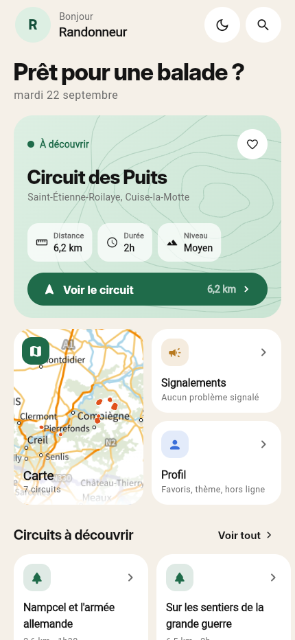
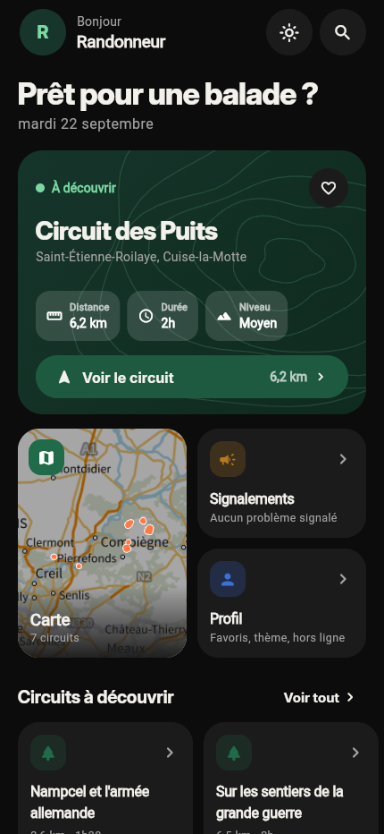
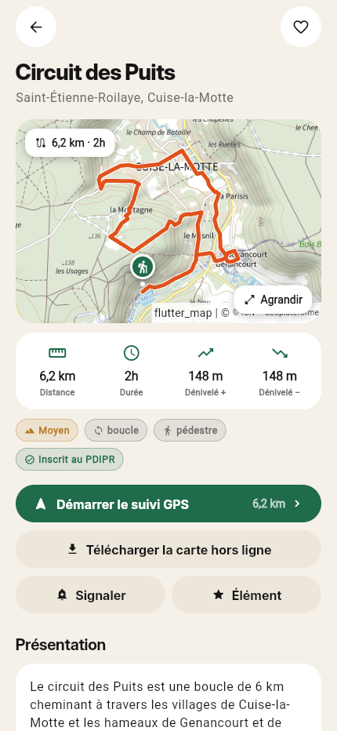
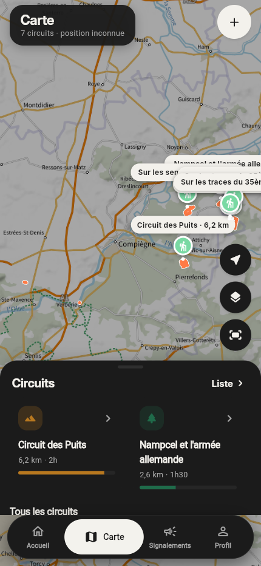

# Rando Oise

Application de randonnée pour l'Oise, en deux parties :

| Dossier | Rôle |
|---|---|
| `apps/rando_user` | Application mobile Flutter (Android / iOS, web possible) pour les randonneurs |
| `apps/rando_admin` | Application web Flutter d'administration (ARC), authentification e‑mail / mot de passe |
| `packages/rando_core` | Package partagé : modèles, conversion Lambert‑93 → WGS84, importeur de sources, accès Firestore, thème |
| `tools/` | Scripts Node : import d'une source de randonnées, création d'un compte admin |
| `firestore.rules` | Règles de sécurité Firestore |
| `data/` | Sources de randonnées (zip au schéma national « itinéraires de randonnée ») |

Backend : Firebase (projet `rando-oise-a4efa`) — Firestore, Authentication, Hosting.

## Fonctionnalités

**App utilisateur**
- Liste des itinéraires en mode liste ou carte, triés depuis une origine (position GPS, point choisi sur la carte, ou par nom), recherche et filtre par source.
- Fiche itinéraire : distance, durée, dénivelé, difficulté, présentation, pas à pas, infos pratiques, signalements et éléments remarquables du circuit.
- Suivi GPS : carte plein écran, position, tracé, distance au tracé, progression, distance parcourue, durée ; affichage optionnel des signalements / éléments.
- Favoris (stockés sur l'appareil).
- Signalement : catégorie (liste déroulante), description, position GPS ou choisie sur la carte. Chaque appareil peut faire « +1 » une seule fois sur un signalement. Le statut (Signalé / En cours / Validé par l'ARC) est visible.
- Éléments remarquables : proposition par les randonneurs, visibles par tous une fois validés par l'admin.
- Hors ligne : persistance Firestore (itinéraires, signalements, éléments), tuiles de carte mises en cache, téléchargement de la carte d'un circuit (zooms 12‑16), écritures mises en file d'attente jusqu'au retour du réseau.

**App admin (web)**
- Connexion par login / mot de passe ; seuls les comptes présents dans la collection `admins` ont accès.
- Liste et fiche des itinéraires, carte globale.
- Signalements : filtres par statut, changement de statut (Signalé / En cours / Validé), commentaire, suppression.
- Éléments remarquables : validation / refus / suppression.
- Sources : import d'un zip ou json, activation / désactivation, suppression.

## Modèle de données (Firestore)

| Collection | Contenu |
|---|---|
| `sources/{id}` | name, producteur, itineraireCount, enabled, bounds, importedAt |
| `itineraires/{uuid}` | sourceId, nom, tracks (polylignes encodées `lat,lng;…`), start, bounds, longueurM, dureeH, difficulte, denivele…, presentation, instructions, parking, transports… |
| `signalements/{id}` | itineraireId, categorie, description, position, statut (`signale` / `en_cours` / `valide`), auteurId, votes, voters[], commentaireAdmin |
| `elements/{id}` | itineraireId, categorie, titre, description, position, statut (`en_attente` / `valide` / `refuse`), auteurId |
| `admins/{uid}` | email, role |

Les règles (`firestore.rules`) autorisent la lecture publique, la création de signalements / éléments par un utilisateur authentifié (anonyme), un seul « +1 » par utilisateur, et réservent le reste aux admins.

## Mise en route

### Prérequis
- Flutter 3.41+, Node 20+, Firebase CLI (`npm i -g firebase-tools`), `dart pub global activate flutterfire_cli`.
- Clé de compte de service Firebase dans `secret/` (jamais commitée).

### Console Firebase (à faire une fois)
1. **Authentication → Commencer** : activer les fournisseurs **Anonyme** (app utilisateur) et **E‑mail / mot de passe** (admin).
2. Firestore est déjà créé (`europe-west1`) et les règles sont déployées avec `firebase deploy --only firestore:rules`.

### Importer une source de randonnées
```bash
cd tools && npm install && cd ..
node tools/import_source.js "data/itinerairerandonnee_CC_des_Lisières_de_l'Oise.zip"
# --dry-run pour vérifier sans écrire
```
L'admin web permet aussi d'importer un zip/json directement (onglet Sources).

### Créer un compte administrateur
```bash
node tools/create_admin.js admin@exemple.fr "MotDePasseSolide"
```

### Lancer les applications
```bash
# App utilisateur (téléphone / émulateur Android)
cd apps/rando_user && flutter run

# App admin (Chrome)
cd apps/rando_admin && flutter run -d chrome
```

### Déployer l'admin sur Firebase Hosting
```bash
cd apps/rando_admin && flutter build web --release && cd ../..
firebase deploy --only hosting:admin
```

### Tests
```bash
cd packages/rando_core && flutter test
```

## Fond de carte
L'app utilisateur propose le Plan IGN (Géoplateforme, sans clé) et OpenStreetMap ; le choix est dans Réglages. Les tuiles affichées sont conservées sur l'appareil, et chaque fiche propose « Télécharger la carte hors ligne ».

## Aperçu de l'app utilisateur

| Accueil (clair) | Accueil (sombre) | Fiche circuit | Carte (sombre) |
|---|---|---|---|
|  |  |  |  |

Captures réalisées sur la version web (Chrome headless, 430 × 932). Police Inter (licence OFL, incluse dans `packages/rando_core/fonts`).
